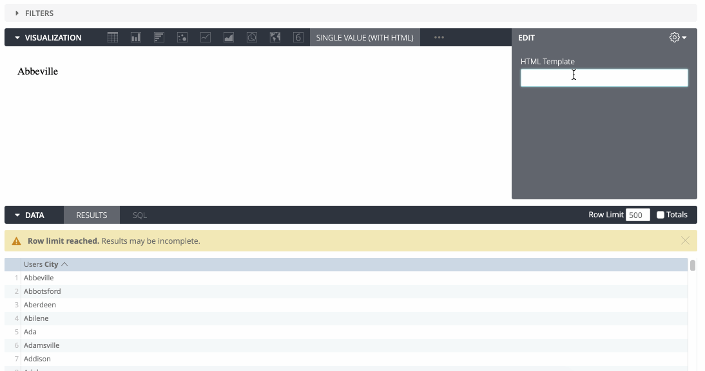

# Another Looker Single Value Viz

This 'chart' allows setting a HTML template on the Looker side, which then gets parsed and rendered by Looker. So if you want a nice looking chart but don't want to crowd your model with html, this one is your friend

## How to use
- Fork or clone this repository
- Get a link to the viz file served with the proper headers. The easiest way is with [Githack](https://raw.githack.com/) or [jsdelivr](https://www.jsdelivr.com/rawgit)
  - Copy the link to the file (e.g `https://github.com/brechtv/abc/blob/master/def.js`)
  - Paste it into Rawgit, copy one of the two urls generated
- Go to your Looker Admin > Visualizations page and add the viz with the rawgit url (dev or prod whichever you like)
- Now go to any explore, run some query, select the custom viz and get ready to throw in the weirdest html, css or whatever! 

## Demo

